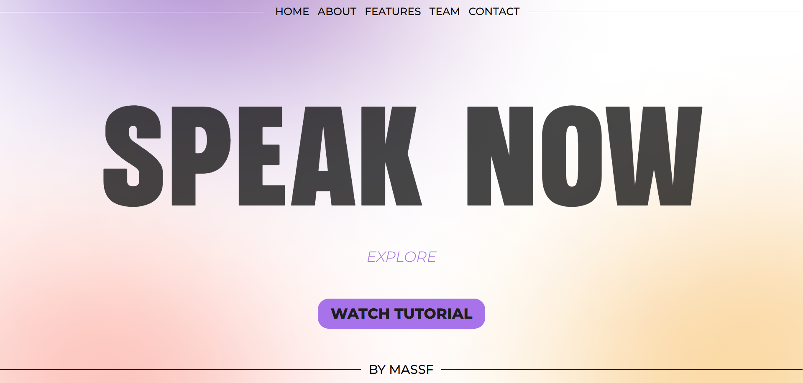
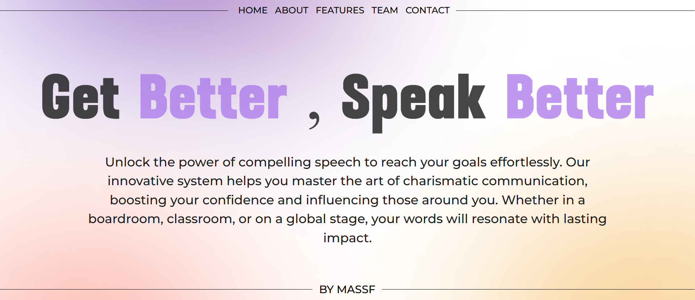
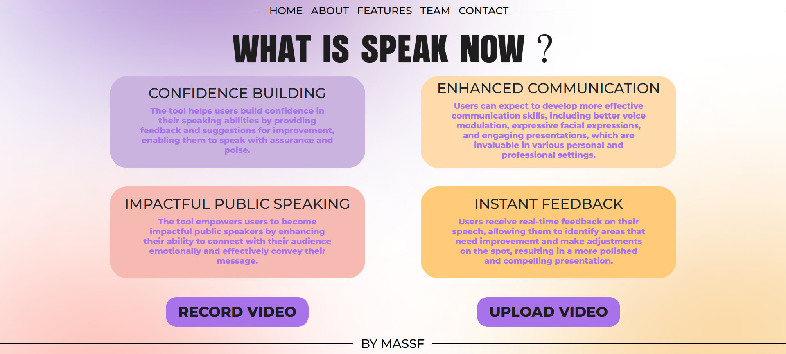
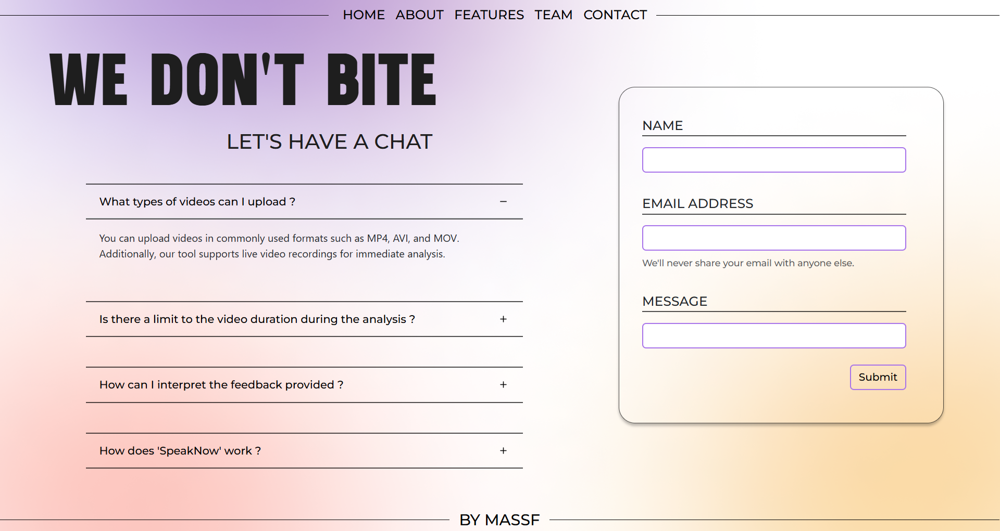
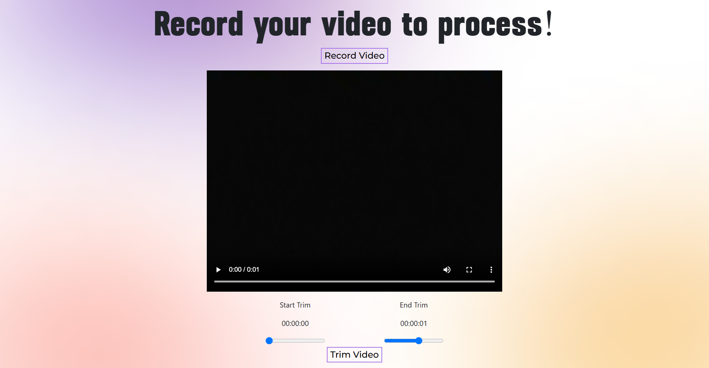
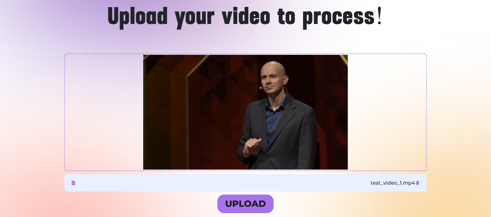
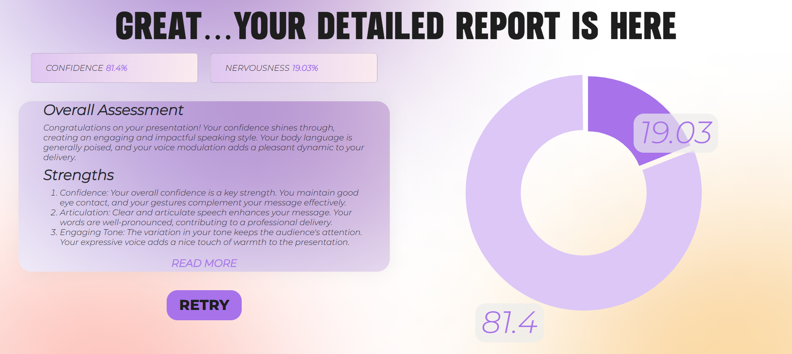

# Speak Now – A Public Speaking Tool for Emotion and Voice Analysis 🗣

## Project Description 📝
**Speak Now** is a web-based public speaking tool designed to help users improve their public speaking skills by providing detailed feedback on their recorded or uploaded presentations. The platform performs a dual analysis on both **facial expressions** and **voice tone**, assessing levels of **nervousness** and **confidence**. The analysis generates comprehensive reports that provide feedback to help users identify their strengths and areas for improvement.

## Features ✨
- **Video Upload and Recording:** Users can upload pre-recorded videos or record their presentations directly on the website.
- **Facial Expression Analysis:** Uses OpenCV and the DeepFace library to detect six key emotions — Angry, Sad, Happy, Disgust, Fear, and Neutral — to assess confidence and nervousness levels.
- **Voice Analysis:** Analyzes tone and pitch to evaluate nervousness and confidence using pre-trained voice models.
- **Comprehensive Reports:** Combines video and voice analysis to generate a detailed feedback report with visual graphs of emotional patterns.

## UI Preview 🖼️

### 🏠 Home Page


### ℹ️ About Page


### ✨ Features Page


### 👥 Team Page


### 📬 Contact Page


## Technologies Used ⚙
- **Frontend:**
  - React.js for UI and interactivity.
- **Backend:**
  - Python with Flask for handling API requests.
  - OpenCV for video processing.
  - DeepFace library for emotion recognition.
  - Pre-trained audio models for voice tone analysis.
- **Other:**
  - Axios for making HTTP requests between frontend and backend.

## Installation and Setup 🔑

### Prerequisites ⚠
Make sure you have the following installed:
- Python 3.x
- Node.js

### Backend Setup (Python + Flask) 🐍
1. **Clone the repository:**
   ```bash
   git clone https://github.com/saradotdev/Speak-Now.git
   ```

2. **Navigate to the backend folder:**
   ```bash
   cd backend
   ```

3. **Install dependencies:**
   ```bash
   pip install -r requirements.txt
   ```

4. **Run the Flask app:**
   ```bash
   python app.py
   ```

### Frontend Setup (React.js) ⚛
1. **Navigate to the frontend folder:**
   ```bash
   cd frontend
   ```

2. **Install frontend dependencies:**
   ```bash
   npm install
   ```

3. **Run the frontend:**
   ```bash
   npm start
   ```

### Usage 🚀
1. Once the backend and frontend servers are running, open your browser and navigate to:
   ```
   http://localhost:3000
   ```

2. You can:
   - **Record a new presentation:** Click on the "Record" button and start recording your presentation.

   

   - **Upload an existing video:** Click on the "Upload" button to upload a video file for analysis.
   
   

3. Once the video is uploaded or recorded, the system will process it and generate a detailed feedback report on your facial expressions and voice tone.



## Additional Information ℹ️
For more information about Speak Now, including project updates, documentation, and community guidelines, please check out the [GitHub repository](https://github.com/saradotdev/Speak-Now).